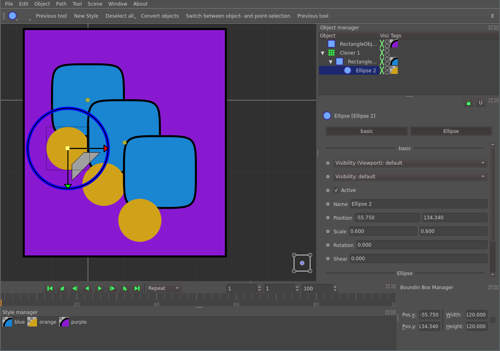
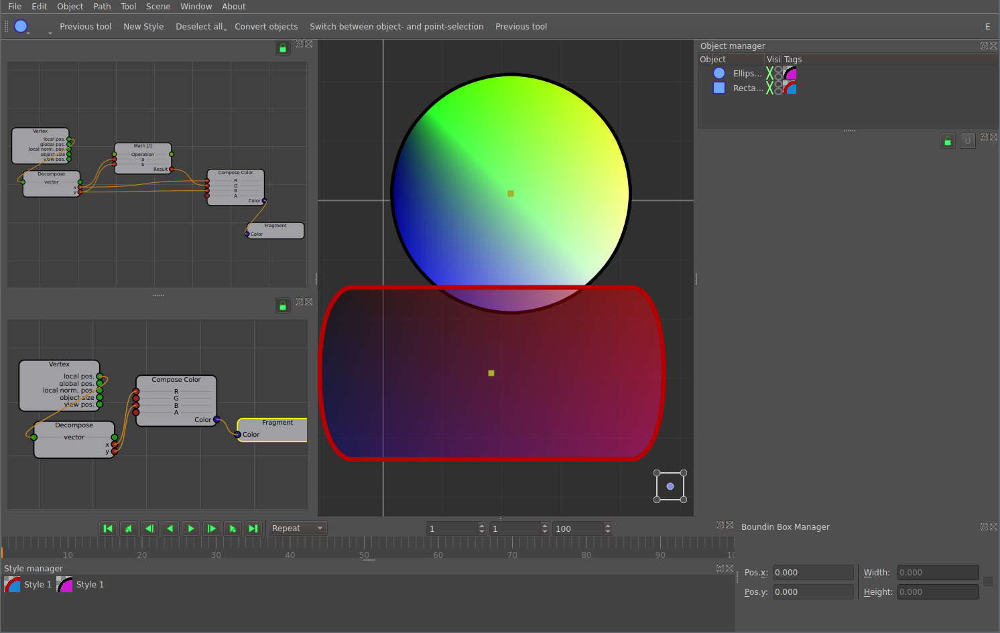
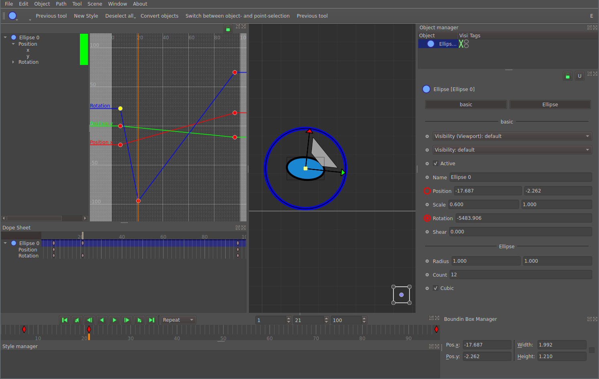
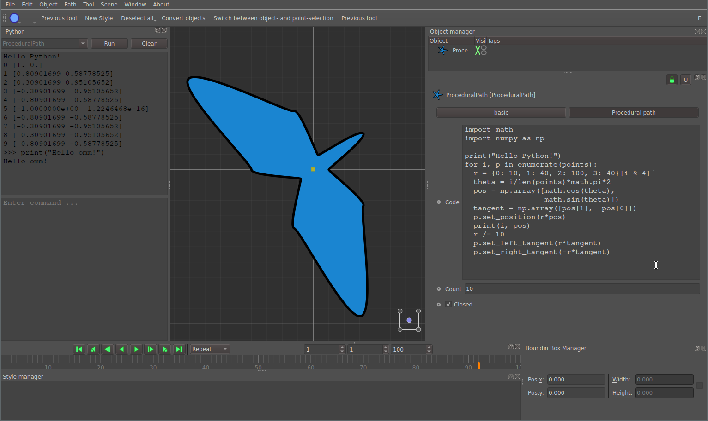
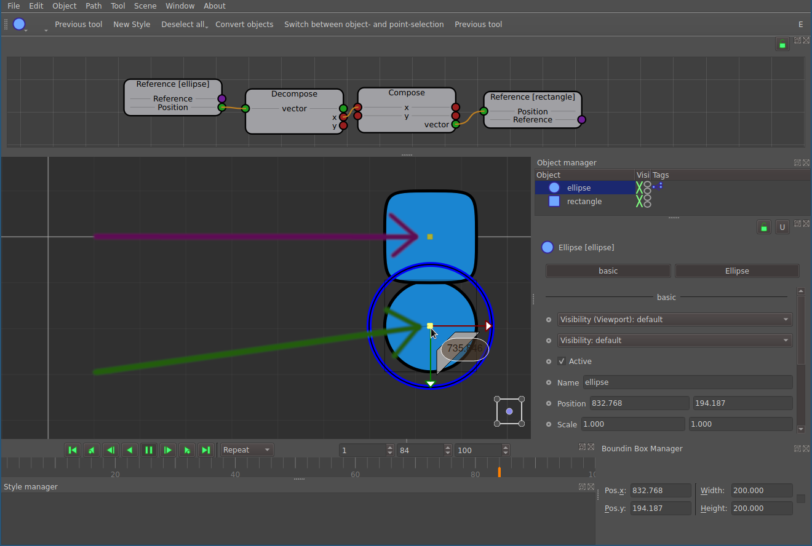

# ommpfritt

*ommpfritt* or short *omm* is a free and open source vector modelling and
motion graphics application.
It brings the workflow of (3D) modelling tools to the 2D vector graphics world.
The design of the application encourages and supports the user to produce
maintainable documents,
using concepts like procedural modelling and non-destructive editing.

Conceptually *omm* is a mix of traditional vector graphic editors
(e.g., *inkscape*), CAD applications and (3D) modelling tools.
Primary use case is creating, editing and rendering all sorts of animated and
still graphics, diagrams, icons and drawings.

## How to Get It

*omm* is [free](https://en.wikipedia.org/wiki/Free_software).
You can get its source from [github](https://github.com/pasbi/ommpfritt) and
build it.
You may find [build instructions](doc/build.md) helpful.

For any **LINUX**, there is an [AppImage](https://github.com/pasbi/ommpfritt/releases),
which requires no installation, make the [downloaded file executable and just run it](https://docs.appimage.org/introduction/quickstart.html#ref-quickstart).
For **WINDOWS**, [there is an installer](https://github.com/pasbi/ommpfritt/releases).

You can install [ommpfritt-git](https://aur.archlinux.org/packages/ommpfritt-git) from the AUR if you prefer a native package on Arch Linux.

*omm* has been tested on various Linux Distributions and Windows.
It has never been tested on **Mac**. It works in theory.

## How to use

*omm* was designed to be very easy to use.
So if you can handle a mouse and a keyboard, it should be no problem to get
started without studying the manual.

There is a (quite outdated)
[screen cast on youtube](https://www.youtube.com/watch?v=6X5Lo7kq5eM)
that shows some of the most important features and how they can be used.

## Contributing

Although you can already use the app, it's still a long way until v1.0.
So we need your help!

See [how to contribute](doc/contribute.md).
Don't hesitate to get in contact with us!

## Related Software

How does *omm* compare to other graphical applicatons?
See [comparison](doc/comparison.md).

## Features

*omm* is
-   general purpose: create any kind of graphics. No limits!
-   interactive: you receive immediate feedback
-   [wysiwyg](https://en.wikipedia.org/wiki/WYSIWYG)

### User Interface

-   load and save scenes to/from human readable **json** format
-   all modifications to a scene can be undone (**unlimited undo/redo-stack**)
-   **simple concept** with few very concrete item classes (*Object*, *Tag*, *Style*, *Tool*)
-   wide **drag'n'drop** support: move, copy or link Objects, Tags and Styles naturally
-   **non-destructive**, **non-linear** editing: properties of Objects, Tags, Styles and Tools can be accessed and modified at any time.
-   build complex, reusable **object hierarchies** and object groups
-   **flexible GUI** using dockable widgets
-   customizable **dark** and **light** skins
-   **multi-selection** support for properties: compatible intersection of properties of all selected items (objects, tags, styles, tools) is shown and can be modified simultaneously
-   **flexible, customizable key binding sequences** (aka short-cuts)
-   **multi-language** (currently English, Spanish and German only)
-   **rasterize** to `png` and `jpg`
-   **export** to SVG

### Styling

-   build complex reusable **style cascades**
-   dynamic **Named Colors**
-   interactive OpenGL-Shaders

### Objects

-   path object: any number of points, closed/open
    -   **bézier** mode: modify the tangents of any point individually
    -   **smooth** mode: tangents are set automatically
    -   **linear** mode: no tangents
    -   subdivide/remove points

-   **procedural** path: control the points and tangents using python

-   **ellipse**, **rectangle**, **line**

-   **empty**: no geometry, but useful as group parent

-   **instance**: all changes of the reference are updated in the instance-object, too

-   **cloner**: many instances in a regular arrangement
    -   grid
    -   linear
    -   along any path
    -   radial
    -   by python script

-   **mirror**

-   **view**: define a view onto the scene for export
    -   set the export region comfortably within the editor
    -   adjust to viewport or vice versa
    -   switch between any number of self-defined views
    -   supports translation, scaling, rotation and shear

### Tags

-   **path tag**: constrain position of any object to any path
-   **style tag**: define the color of an object
-   **script tag**: general purpose scripting without limits

### Tools

-   object selection: select in viewport and rotate, move or scale* along common center of all selected objects
-   point-level: select in viewport and rotate, move or scale* along common center of all selected points. Works fine even if many path-objects are selected.
-   optinally transform axes only. Re-set the origin of the object without affecting its geometry.
-   brush-select: select points as if you were painting
-   Bounding Box-Handle

### Animation

-   Keyframe Animation
-   Responsive Timeline
-   Dope Sheet
-   Seamless integration into undo/redo and multi-property- and multi-object-selection

### Programmable

-   **programmable**: every property can be controlled via embedded python scripting

-   visual node-based scripting alternative

-   user properties can be added at runtime to any object

### Optional Command Line Interface

-   Batch rendering from command line
-   Get basic scene information from command line
